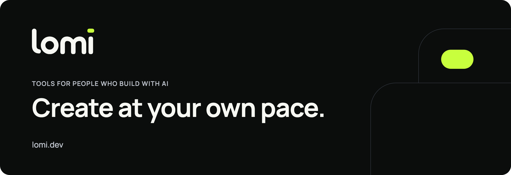
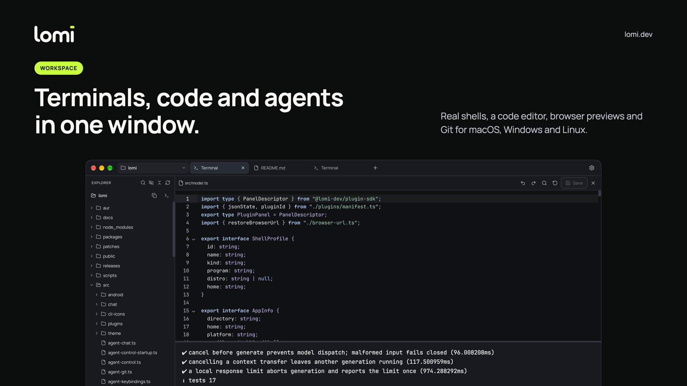
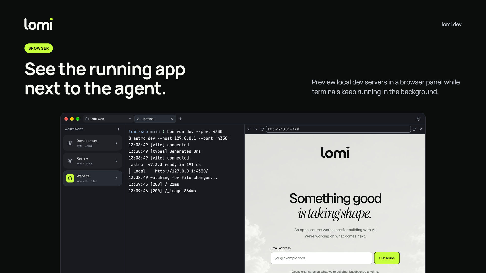
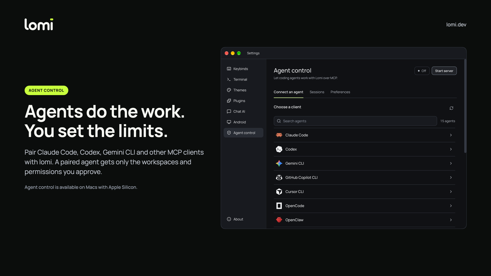
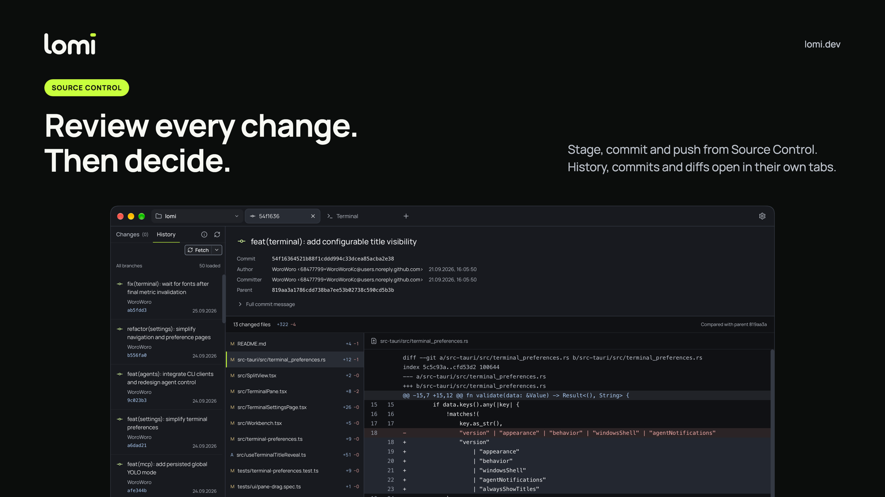
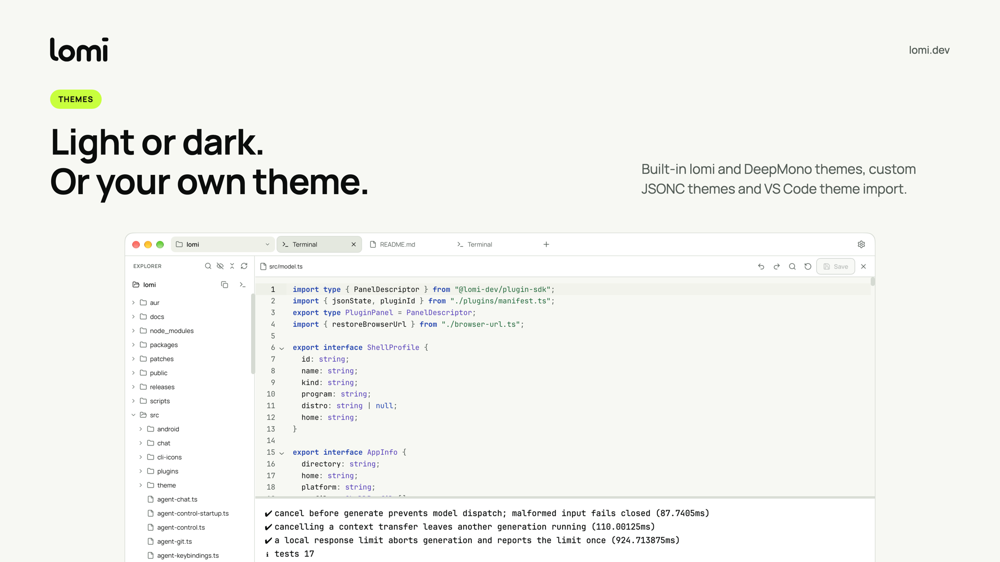

<picture>
  <source media="(prefers-color-scheme: dark)" srcset="assets/hero-dark.png" />
  <source media="(prefers-color-scheme: light)" srcset="assets/hero-light.png" />
  
</picture>

  <a href="https://lomi.dev"><b>Website</b></a> ·
  <a href="https://github.com/lomi-dev/lomi/releases/latest"><b>Download lomi</b></a> ·
  <a href="#build-on-lomi"><b>Build a plugin</b></a> ·
  <a href="#get-involved"><b>Get involved</b></a>

We make open-source tools for people who build software with AI. Friendly
form makes it easy to start; precision helps finish the work. Our desktop apps
run on your machine, with no account and no telemetry.

##  lomi

**The open-source desktop workspace for terminal-driven development.**

  
  
  
  

Open a project folder and arrange real shells, a code editor, browser previews,
Git and AI chat side by side. Run Claude Code, Codex, Gemini CLI or any other
CLI agent in a lomi terminal, and let it work with your workspace over MCP once
you approve it.

- **Workspaces.** Dock terminals, editors, browsers and chats in any split layout.
  Terminals keep running while you switch between tasks.
- **Native terminals.** Real shells through `portable-pty`, rendered by xterm.js
  with WebGL. Bash, Zsh, Fish, PowerShell and WSL.
- **Coding agents.** lomi recognizes more than 30 CLI agents on macOS and Linux.
  Agent control gives a paired agent only the workspaces and permissions you
  approve.
- **Git.** Stage, commit, pull and push, browse history and review diffs. Nothing
  is committed or pushed without an explicit action.
- **Make it yours.** Light and dark themes, VS Code theme import, custom
  keybinds and trusted local plugins.

<b>See more of lomi</b>

 
<table>
  <tr>
    <td width="50%"></td>
    <td width="50%"></td>
  </tr>
  <tr>
    <td width="50%"></td>
    <td width="50%"></td>
  </tr>
</table>
Agent control currently requires a Mac with Apple Silicon.

Download lomi for macOS (signed and notarized), Windows or Linux (AppImage,
`.deb` or `.rpm`) from the [latest release](https://github.com/lomi-dev/lomi/releases/latest).
Built with Tauri 2, Rust, React and TypeScript.

## Build on lomi

Plugins add views, sidebars, commands, status bar items and themes to lomi. The
toolchain is in alpha, and each part lives in its own repository.

<table>
  <tr>
    <td width="33%" valign="top">
      <a href="https://github.com/lomi-dev/plugin-sdk"><b>plugin-sdk</b></a>
      
The plugin contract: TypeScript APIs, the shared React runtime, manifest validation and build helpers.

      
    </td>
    <td width="33%" valign="top">
      <a href="https://github.com/lomi-dev/plugin-tools"><b>plugin-tools</b></a>
      
The <code>lomi-plugin</code> CLI: <code>check</code>, <code>build</code>, <code>doctor</code> and <code>package</code>, with testing helpers and an example plugin.

      
    </td>
    <td width="33%" valign="top">
      <a href="https://github.com/lomi-dev/create-lomi-plugin"><b>create-lomi-plugin</b></a>
      
The project generator, with panel, sidebar, command and theme templates and pinned SDK and CLI versions.

      
    </td>
  </tr>
</table>

Plugins run as trusted local code. Importing a package never runs it: you review
it and choose **Trust and enable** first. Start `lomi --safe-mode` to skip
third-party plugins and themes.

##  Simplevoice

**Local speech-to-text and voice typing for macOS, Linux and Windows.**

  
  

Speak anywhere, and the text lands in the active app. Transcribe offline with
Whisper, Parakeet or Zipformer models, or connect your own cloud provider key.
Recordings and history are stored on your device.
[Get Simplevoice](https://github.com/lomi-dev/simplevoice) or visit
[simplevoice.app](https://simplevoice.app).

## How we build

<table>
  <tr>
    <td width="50%" valign="top">
      <b>Local by default</b>
      
No account and no telemetry. API keys stay in your system credential store, and history stays on your device.

    </td>
    <td width="50%" valign="top">
      <b>Visible agency</b>
      
Agents get only the workspaces and permissions you approve. Agent configuration changes only after a click, and lomi keeps a backup.

    </td>
  </tr>
  <tr>
    <td width="50%" valign="top">
      <b>Native where it counts</b>
      
Real shells through <code>portable-pty</code>, a Rust core on Tauri 2 and the system webview, packaged for macOS, Linux and Windows.

    </td>
    <td width="50%" valign="top">
      <b>Open source</b>
      
Our apps and the plugin toolchain are Apache-2.0. Issues and pull requests are welcome.

    </td>
  </tr>
</table>

## Get involved

- **Try lomi.** Download the [latest release](https://github.com/lomi-dev/lomi/releases/latest)
  and open your first project folder.
- **Report an issue.** Open it in the repository it concerns, for example
  [lomi issues](https://github.com/lomi-dev/lomi/issues).
- **Contribute.** Start with the [contributing notes](https://github.com/lomi-dev/lomi#contributing)
  in lomi. Each repository's README explains how to build and test it.
- **Follow along.** Sign up for the newsletter at [lomi.dev](https://lomi.dev).
  The site's source is in [lomi-web](https://github.com/lomi-dev/lomi-web).

 

  
   
  Create at your own pace.

